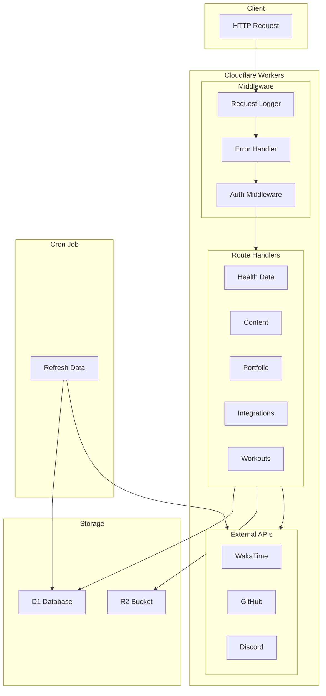

# Personal API (V1)


Private personal API built for Cloudflare Workers + D1.

## Architecture



## Documentation

Interactive API documentation is available at **[https://api.anuragd.me/docs](https://api.anuragd.me/docs)** (requires Bearer token authentication).

The Swagger UI interface provides:
- Complete API reference with all 149+ endpoints
- Interactive "Try it out" functionality to test endpoints directly
- Request/response schemas and validation rules
- Authentication testing with Bearer token

To use the interactive documentation:
1. Navigate to `/docs` in your browser (no authentication required to view)
2. Browse all endpoints and their documentation
3. When you want to test endpoints, click the "Authorize" button and enter your Bearer token
4. Explore and test endpoints with live API calls

The OpenAPI 3.0 specification is also available at `/openapi.json` for programmatic access.

## V1 endpoints

All `/v1/*` routes require `Authorization: Bearer <API_TOKEN>`.

List endpoints support `?limit&offset&search&sort&tags&start&end` where applicable.

### Core

- `GET /openapi.json` (no auth) - OpenAPI 3.0 specification
- `GET /docs` (no auth) - Interactive API documentation (Swagger UI)
- `GET /health` (auth required)
- `GET /v1/export`

### Profile & Settings

- `GET /v1/profile`
- `PUT /v1/profile`
- `GET /v1/now`
- `PUT /v1/now`
- `GET /v1/settings`
- `PUT /v1/settings`

### Content

- `GET /v1/projects`
- `GET /v1/projects/{id}`
- `POST /v1/projects`
- `PUT /v1/projects/{id}`
- `PATCH /v1/projects/{id}`
- `DELETE /v1/projects/{id}`
- `GET /v1/notes`
- `GET /v1/notes/{id}`
- `POST /v1/notes`
- `PUT /v1/notes/{id}`
- `PATCH /v1/notes/{id}`
- `DELETE /v1/notes/{id}`
- `GET /v1/events`
- `GET /v1/events/{id}`
- `POST /v1/events`
- `PUT /v1/events/{id}`
- `PATCH /v1/events/{id}`
- `DELETE /v1/events/{id}`
- `GET /v1/posts`
- `GET /v1/posts/{id}`
- `POST /v1/posts`
- `PUT /v1/posts/{id}`
- `PATCH /v1/posts/{id}`
- `DELETE /v1/posts/{id}`
- `GET /v1/photos`
- `GET /v1/photos/{id}`
- `POST /v1/photos`
- `PUT /v1/photos/{id}`
- `PATCH /v1/photos/{id}`
- `DELETE /v1/photos/{id}`
- `POST /v1/photos/upload`

### Custom Workouts & Logs

- `GET /v1/custom/exercises`
- `POST /v1/custom/exercises`
- `GET /v1/custom/exercises/{id}`
- `PUT /v1/custom/exercises/{id}`
- `DELETE /v1/custom/exercises/{id}`
- `GET /v1/custom/workout-templates`
- `POST /v1/custom/workout-templates`
- `GET /v1/custom/workout-templates/{id}`
- `PUT /v1/custom/workout-templates/{id}`
- `DELETE /v1/custom/workout-templates/{id}`
- `GET /v1/custom/workout-schedules`
- `POST /v1/custom/workout-schedules`
- `GET /v1/custom/workout-schedules/{id}`
- `PUT /v1/custom/workout-schedules/{id}`
- `DELETE /v1/custom/workout-schedules/{id}`
- `GET /v1/custom/workout-sessions`
- `POST /v1/custom/workout-sessions`
- `GET /v1/custom/workout-sessions/{id}`
- `PUT /v1/custom/workout-sessions/{id}`
- `DELETE /v1/custom/workout-sessions/{id}`
- `GET /v1/custom/workout-sessions/{id}/sets`
- `POST /v1/custom/workout-sessions/{id}/sets`
- `POST /v1/custom/workout-sessions/{id}/sets/bulk`
- `PATCH /v1/custom/workout-sessions/{id}/sets/{set_id}`
- `DELETE /v1/custom/workout-sessions/{id}/sets/{set_id}`
- `GET /v1/custom/workout-sets`
- `GET /v1/logs`
- `POST /v1/logs`
- `GET /v1/logs/{id}`
- `PUT /v1/logs/{id}`
- `DELETE /v1/logs/{id}`

### Portfolio

- `GET /v1/experience`
- `GET /v1/experience/{id}`
- `POST /v1/experience`
- `PUT /v1/experience/{id}`
- `PATCH /v1/experience/{id}`
- `DELETE /v1/experience/{id}`
- `GET /v1/education`
- `GET /v1/education/{id}`
- `POST /v1/education`
- `PUT /v1/education/{id}`
- `PATCH /v1/education/{id}`
- `DELETE /v1/education/{id}`
- `GET /v1/skills`
- `GET /v1/skills/{id}`
- `POST /v1/skills`
- `PUT /v1/skills/{id}`
- `PATCH /v1/skills/{id}`
- `DELETE /v1/skills/{id}`
- `GET /v1/uses`
- `GET /v1/uses/{id}`
- `POST /v1/uses`
- `PUT /v1/uses/{id}`
- `PATCH /v1/uses/{id}`
- `DELETE /v1/uses/{id}`
- `GET /v1/shelf`
- `GET /v1/shelf/{id}`
- `POST /v1/shelf`
- `PUT /v1/shelf/{id}`
- `PATCH /v1/shelf/{id}`
- `DELETE /v1/shelf/{id}`

### Location

- `GET /v1/location`
- `GET /v1/location/{id}`
- `POST /v1/location`
- `PUT /v1/location/{id}`
- `PATCH /v1/location/{id}`
- `DELETE /v1/location/{id}`
- `GET /v1/location/latest`

### Apple Health Data

- `GET /v1/health` - Get daily health metrics (date range)
- `POST /v1/health` - Submit daily health metrics
- `GET /v1/health/{date}` - Get health data for specific date
- `DELETE /v1/health/{date}` - Delete health data for specific date
- `GET /v1/health/heart-rate` - Get heart rate samples
- `POST /v1/health/heart-rate` - Submit heart rate samples (single or batch)
- `GET /v1/health/sleep` - Get sleep sessions
- `POST /v1/health/sleep` - Submit sleep session
- `GET /v1/health/workouts` - Get workout sessions
- `POST /v1/health/workouts` - Submit workout
- `GET /v1/health/workouts/{id}` - Get workout
- `PUT /v1/health/workouts/{id}` - Update workout
- `PATCH /v1/health/workouts/{id}` - Patch workout
- `DELETE /v1/health/workouts/{id}` - Delete workout
- `GET /v1/health/summary` - Get health summary with recent data and averages

See [APPLE_HEALTH_EXPORT.md](docs/APPLE_HEALTH_EXPORT.md) for detailed health API documentation.

### External Integrations

- `GET /v1/status` - Latest Lanyard/Discord status
- `POST /v1/status/refresh` - Refresh status snapshot
- `GET /v1/wakatime` - WakaTime daily summaries
- `POST /v1/wakatime/refresh` - Refresh WakaTime daily data
- `POST /v1/wakatime/backfill` - Backfill WakaTime daily data
- `GET /v1/wakatime/hourly` - WakaTime hourly data
- `POST /v1/wakatime/hourly/refresh` - Refresh WakaTime hourly data
- `POST /v1/wakatime/hourly/backfill` - Backfill WakaTime hourly data
- `GET /v1/github` - GitHub contributions
- `POST /v1/github/refresh` - Refresh GitHub contributions
- `POST /v1/github/backfill` - Backfill GitHub contributions
- `POST /v1/refresh` - Refresh all (status, WakaTime, GitHub)

### Analytics & Wrapped

- `GET /v1/wrapped/day` - Daily wrapped stats
- `GET /v1/wrapped/week` - Weekly wrapped stats
- `GET /v1/wrapped/month` - Monthly wrapped stats
- `GET /v1/wrapped/2026` - 2026 wrapped stats

## Data model

The API stores JSON fields as `*_json` text columns in D1.

## Quickstart

Example request:

```bash
curl -H "Authorization: Bearer $API_TOKEN" https://api.anuragd.me/health
```

## Refresh & backfill

- `POST /v1/refresh` refreshes status, WakaTime (daily + hourly), and GitHub if configured.
- Backfill endpoints accept JSON like:

```json
{ "start": "2025-01-01", "end": "2025-12-31" }
```

## Cloudflare setup

### Deploy guide (Workers + D1)

1) Install Wrangler and login:
   - `npm install`
   - `npx wrangler login`
2) Create a D1 database:
   - `npx wrangler d1 create personal_api`
   - Copy the `database_id` into `wrangler.toml`.
3) Run migrations:
   - `npx wrangler d1 migrations apply personal_api --local`
   - `npx wrangler d1 migrations apply personal_api --remote`
4) Set secrets:
   - `npx wrangler secret put API_TOKEN`
5) Set Lanyard user id (optional, for status snapshots):
   - `npx wrangler secret put LANYARD_USER_ID`
6) Set WakaTime API key (optional, for activity snapshots):
   - `npx wrangler secret put WAKATIME_API_KEY`
7) Set WakaTime timezone (optional, for hourly data):
   - `npx wrangler secret put WAKATIME_TIMEZONE`
8) Set GitHub username/token (optional, for wrapped stats):
   - `npx wrangler secret put GITHUB_USERNAME`
   - `npx wrangler secret put GITHUB_TOKEN`
9) Configure R2 (optional, for photo uploads):
   - Create an R2 bucket (example: `personal-api-photos`).
   - Set the bucket name in `wrangler.toml` under `[[r2_buckets]]` for `R2_BUCKET`.
   - Set `R2_PUBLIC_BASE_URL` in `wrangler.toml` (or as a secret) to your public bucket URL.
10) Deploy:
   - `npx wrangler deploy`

### Cron (optional)

`wrangler.toml` includes a cron trigger to refresh status snapshots every 5 minutes and WakaTime daily/hourly. It also sets `API_VERSION`, returned by `/health`.

Link to Lanyard api (JSON): https://api.lanyard.rest/v1/users/{DISCORD_USER_ID}

### Secrets

Use `.env.example` for local values. Never commit real secrets; set them with `wrangler secret put`.

### Local dev (optional)

- `npx wrangler dev src/index.ts`

## Notes

### Photo uploads (R2)

`POST /v1/photos/upload` expects raw image bytes with an `image/*` content type.

Example:

```bash
curl -X POST https://api.anuragd.me/v1/photos/upload \
  -H "Authorization: Bearer $API_TOKEN" \
  -H "Content-Type: image/jpeg" \
  --data-binary "@./photo.jpg"
```
